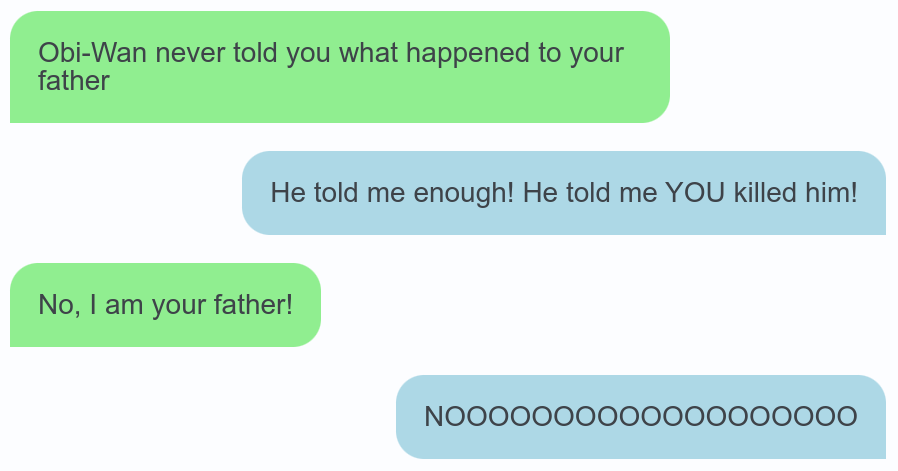

# mdx_convo

Markdown extension for displaying message conversations.

The following Markdown..

```
<convo>
< Obi-Wan never told you what happened to your father
> He told me enough! He told me YOU killed him!
< No, I am your father!
> NOOOOOOOOOOOOOOOOOOO
</convo>
```

..results in the following HTML..

```html
<div class="mdx-convo">
<div class="mdx-convo-speech-left">Obi-Wan never told you what happened to your father</div>
<div class="mdx-convo-speech-right">He told me enough! He told me YOU killed him!</div>
<div class="mdx-convo-speech-left">No, I am your father!</div>
<div class="mdx-convo-speech-right">NOOOOOOOOOOOOOOOOOOO</div>
</div>
```

..and could be styled like this..




## Example usage

```python
import markdown
import mdx_convo

md = markdown.Markdown(
	extensions = [
		markdown_inline_convo.makeExtension()
	]
)

return md.convert(<string>)
```
